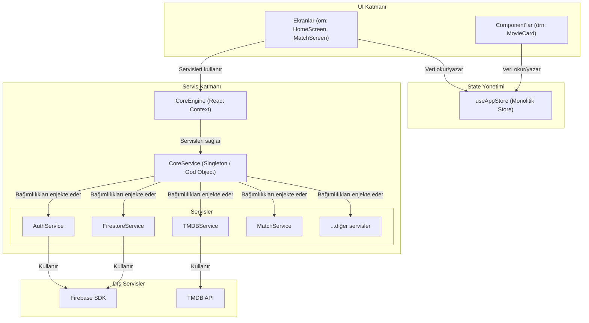

# 🏗️ WMatch - Mimari Diyagramlar (Metin Tabanlı)

**Tarih:** 2025-11-08

---

## 1. Mevcut Mimari Akış Diyagramı

Bu diyagram, WMatch uygulamasının mevcut mimarisini ve bileşenler arasındaki sıkı bağımlılıkları göstermektedir. `CoreService` merkezi bir "God Object" olarak çalışmakta ve tüm servisleri birbirine bağlamaktadır. State yönetimi ise tek bir monolitik store üzerinden yapılmaktadır.



**Mevcut Mimarinin Zayıflıkları:**
-   **Yüksek Bağımlılık (Tight Coupling):** Tüm servisler `CoreService` üzerinden birbirine bağlıdır.
-   **Test Edilemezlik:** Servisleri bağımsız olarak test etmek zordur.
-   **Performans Riski:** Monolitik `useAppStore`, gereksiz re-render'lara neden olabilir.

---

## 2. Önerilen Mimari Akış Diyagramı (Dependency Injection ve Sliced State ile)

Bu diyagram, bağımlılıkların bir DI Container (örneğin, `tsyringe`) ile yönetildiği, iş mantığının "Use Case" katmanına taşındığı ve state'in mantıksal parçalara ("slices") ayrıldığı daha modüler ve ölçeklenebilir bir mimariyi göstermektedir.

```mermaid
graph TD
    subgraph Sunum Katmanı (Presentation)
        Screens["Ekranlar"]
        Components["Component'lar"]
    end

    subgraph State Yönetimi (Sliced Stores)
        UserStore["useUserStore"]
        MovieStore["useMovieStore"]
        MatchStore["useMatchStore"]
        SettingsStore["useSettingsStore"]
    end

    subgraph İş Mantığı Katmanı (Domain)
        UseCases["Use Cases (örn: LoginUser, FindMatches)"]
    end

    subgraph Veri Katmanı (Data)
        Repositories["Repositories (Arayüzler)"]
        Services["Servisler (Implementasyonlar)"]
        DI_Container["DI Container (örn: tsyringe)"]
    end

    subgraph Dış Servisler
        Firebase["Firebase SDK"]
        TMDB_API["TMDB API"]
        AsyncStorage["AsyncStorage"]
    end

    %% İlişkiler
    Screens -- "Veri okur/yazar" --> UserStore
    Screens -- "Veri okur/yazar" --> MovieStore
    Screens -- "Çağırır" --> UseCases

    UseCases -- "Bağımlıdır" --> Repositories
    Repositories -- "Implemente edilir" --> Services

    Services -- "DI Container tarafından yönetilir" --> DI_Container
    UseCases -- "DI Container tarafından yönetilir" --> DI_Container

    Services -- "Kullanır" --> Firebase
    Services -- "Kullanır" --> TMDB_API
    Services -- "Kullanır" --> AsyncStorage
```

**Önerilen Mimarinin Avantajları:**
-   **Düşük Bağımlılık (Loose Coupling):** Bileşenler, somut implementasyonlar yerine soyut arayüzlere (Repositories, Use Cases) bağımlıdır.
-   **Yüksek Test Edilebilirlik:** Her katman (UI, Use Case, Service) bağımsız olarak test edilebilir.
-   **Gelişmiş Performans:** Sliced store'lar, gereksiz re-render'ları engelleyerek performansı artırır.
-   **Ölçeklenebilirlik:** Yeni özellikler, mevcut kodu bozmadan kolayca eklenebilir.
